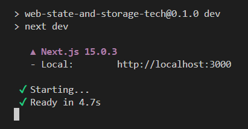
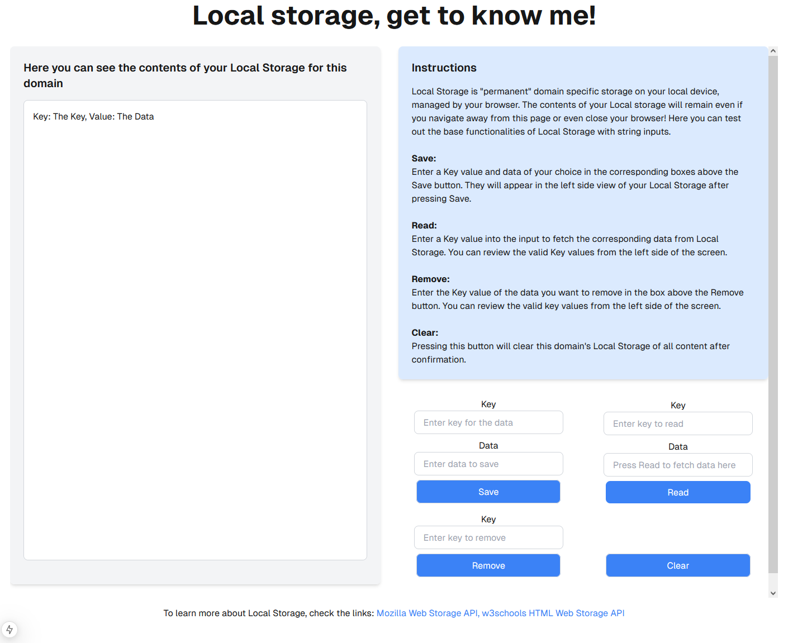

# Readme

The purpose of this project is to create a simple web application utilizing [**Next.js**](https://nextjs.org/) and [**Tailwind CSS**](https://tailwindcss.com/). The application showcases the use of one or more of the following data storage and state management solutions, which are integral to modern web development:

- **Cookies**
- **JWT (JSON Web Token)**
- **Session ID**
- **Local Storage**

## Getting started

This project is currently in development phase and only available to run as a local copy by [forking](https://docs.github.com/en/pull-requests/collaborating-with-pull-requests/working-with-forks/fork-a-repo) and/or [cloning](https://docs.github.com/en/repositories/creating-and-managing-repositories/cloning-a-repository) from this repository.

After you have successfully fetched a local copy, run `npm install` in the project root folder to install the necessary dependencies.

Once the dependencies are installed you can use `npm run dev` to run the app and the use your browser to access the app at the given port for localhost, 3000 in the example below.

### Browser view

This is the landing page where you can navigate using the provided buttons:

Currently only the Local Storage page has meaningful content and the other buttons are disabled.

#### Local Storage

The main functionality of the page is to enable very basic testing of Web Storage API methods getItem(), setItem(), removeItem() and clear() which are used to interact with Local Storage. The Local Storage page has instructions on the usage of the page itself and a brief on Local Storage. 

## Understanding the Data Storage and State Management Techniques

### Cookies

Cookies are small, often max 4 KB/cookie, amounts of data, usually created by a webserver and stored clientside by the browser. Cookies are by default automatically sent by the browser with every request associated with that cookie's domain.

Originally created to solve the statelessness issue of the HTTP protocol in the 1990s, cookies still see wide contemporary use. Cookies are used to store, for example, user preferences or Session IDs. Of course, cookies can also be used to track internet activity and profile users, often in hopes of better advertisement targeting.

Cookies consist of key-value pairs and additional metadata. While the key-value pair contains the actual data meant to be transferred between the client and the server, metadata contains various important flags and additional information.

Cookie content example:  
`sessionId=abc123; Path=/; HttpOnly; Secure; SameSite=Strict`  

In the example above, ``sessionId=abc123`` is the key-value pair. ``Path=/`` denotes the URL path within the domain where the cookie should be included in the request. In this example all requests to the domain should include this cookie. ``HttpOnly``, ``Secure`` and ``SameSite=Strict`` are important flags which limit the usage and increase the security of the cookie. ``HttpOnly`` restricts access to the cookie by clientside JavaScript and ``Secure`` marks the cookie to be only transmitted via HTTPS connections. ``SameSite=Strict`` is a way to mitigate the risk of CSRF attacks as this prevents the cookie being sent with cross-origin requests.

### JWT

JSON Web Tokens are a standardized way of storing/transmitting data, most often used in the process of authorizing a user to access certain content on a webserver after they have been authenticated.

One core advantage of JWTs is that they are self-contained. They contain all the necessary data to authorize the token bearer to do what they want to do and so the server does not have to maintain session data in a database or in-memory storage.

a JWT consists of a Header, Payload and Signature separated by dots. The header contains metadata about the token (type, signing algorithm), the payload contains the actual content (claims) and the signature is a way for the issuing server to check that the token has not been modified clientside.

JWT can be stored clientside in a cookie, Local Storage or Session Storage. Out of these, cookie with correct flags is the safest option.

### Session ID

Session ID is a way for a website to identify a user and maintain information about what the user is doing and possible data serverside during the session. For example providing the user seamless interaction across a multipage domain or maintaining the contents of a shopping-cart.

Session ID is created by the server and sent to the user, often in a cookie.  It is most often a randomly generated alphanumeric string. The user subsequentially send the Session ID with every request related to that session (if it was stored in a cookie).

Session ID can be given a finite lifespan by setting an expiration date for the cookie it was transmitted in. 

### Local Storage

Part of Web Storage API, which enables browsers, and by extension websites, to store data locally on the client-side. The data in Local Storage is stored indefinitely unless expicilty deleted by the user or the website.

Storage of data in Local Storage is done with key-value pairs, where the actual value (data) is stored in string format. Local Storage offers a rather sizable amount of storage space to websites, up to 5-10 MB, depending on the browser.

Data in Local Storage is meant to be domain specific and thus somewhat isolated but as it is accessible via JavaScript, it is vulnerable to XSS attacks.

Related to Local Storage is Session Storage which is essentially the same, but automatically clears itself when the user closes the related browser tab.

## Sources

Below are listed some sources used in writing of the [Understanding the Data Storage and State Management Techniques](#understanding-the-data-storage-and-state-management-techniques) part of this Readme and to increase the overall understanding of project members concerning the concepts and technologies used.

### Cookies

- [mdn web docs_ - Using HTTP cookies](https://developer.mozilla.org/en-US/docs/Web/HTTP/Cookies)

### JWT

- [jwt.io](https://jwt.io/)
- [rfc-editor - RFC 7519 (JWT)](https://www.rfc-editor.org/info/rfc7519)

### Session ID

- [techtarget - session ID](https://www.techtarget.com/searchsoftwarequality/definition/session-ID)

### Local Storage
- [w3schools HTML Web Storage API](https://www.w3schools.com/html/html5_webstorage.asp)
- [mdn web docs - Web Storage API](https://developer.mozilla.org/en-US/docs/Web/API/Web_Storage_API)

### Various subjects
- [ChatGpt](https://chatgpt.com/)
- [Youtube - Web Dev Simplified - JavaScript Cookies vs Local Storage vs Session Storage](https://www.youtube.com/watch?v=GihQAC1I39Q)
- [Youtube - Web Dev Simplified -  What Is JWT and Why Should You Use JWT ](https://www.youtube.com/watch?v=7Q17ubqLfaM)
- [Youtube - Matt on Data Science - JWT Authentication Explained](https://www.youtube.com/watch?v=iHNkGQyJxJs)
- [Youtube - ByteMonk -  JSON Web Tokens (JWTs) explained with examples | System Design ](https://www.youtube.com/watch?v=iB__rLXGsas)
- [Youtube - ByteMonk -  OAuth 2.0 explained with examples ](https://www.youtube.com/watch?v=ZDuRmhLSLOY)
- [Youtube - Nikita Dev -  How Does JWT Authentication Work? (JSON Web Token) | Tokens vs Sessions ](https://www.youtube.com/watch?v=hoBSjmrwF1k)
- [Youtube - ByteByteGo -  Session Vs JWT: The Differences You May Not Know! ](https://www.youtube.com/watch?v=fyTxwIa-1U0)
- [Youtube - Code Realm -  Authentication on the Web (Sessions, Cookies, JWT, localStorage, and more) ](https://www.youtube.com/watch?v=2PPSXonhIck)
- [Youtube - Steve Griffith - Prof3ssorSt3v3  - Browser Persistent Data Storage ](https://www.youtube.com/watch?v=OOcxXyckmcs)